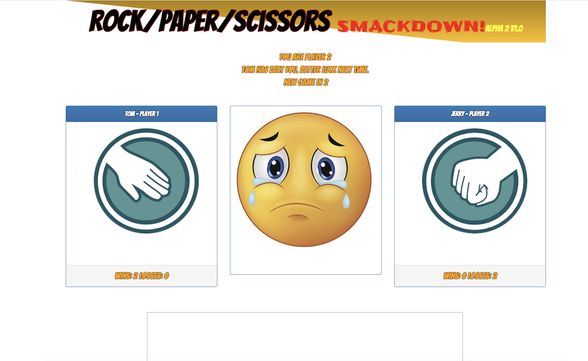

# Rock,Paper,Scissors - Multiplayer

## What Is It?
A multiplayer rock, paper, scissors game.

## How Do I Play?
* Only two users can play at the same time.

* Both players pick either `rock`, `paper` or `scissors`. After the players make their selection, the game will tell them whether a tie occurred or if one player defeated the other.

* The game will track each player's wins and losses.

* The game comes with built in chat functionality! No online multiplayer game is complete without having to endure endless taunts and insults from your jerk opponent.
  
## How Do I Get In On This?
1. The game is hosted on GitHub Pages, all you have to do is click [HERE](https://xtiane.github.io/RPS-Multiplayer/)

## Under The Hood
This game was built using HTML/CSS/JavaScript, JQuery and Firebase.
